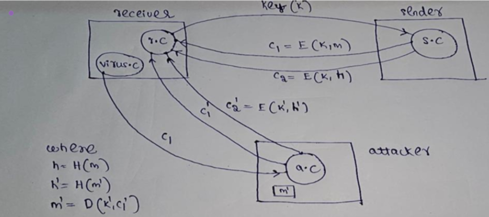

# Secure Client-Server Communication

This project demonstrates a **secure cryptographic communication system** designed to protect message integrity and confidentiality in the presence of potential cyberattacks — particularly **message tampering by malicious third parties**.

---

## 🚀 Overview

The communication protocol begins with the **receiver** sending a secure symmetric key to the **sender**. Using this key, the sender encrypts the message with the **AES (Advanced Encryption Standard)** algorithm and transmits the ciphertext to the receiver. However, the system is designed to handle a more dangerous scenario:  

An **attacker** may compromise the receiver’s system and inject a **modified ciphertext**, attempting to trick the receiver with a forged message.

To mitigate this, our system uses a **cryptographic hash authentication mechanism** that ensures the **authenticity and integrity** of the message, even in adversarial conditions.

---

## 🔑 Key Features

- 🔐 **AES Encryption**: Secure symmetric encryption of messages.
- 🧠 **SHA-256 Hashing**: Strong hash function to detect message changes.
- 🔏 **Encrypted Hash Authentication**:
  - Sender creates a hash of the message and encrypts it using their **private key**.
  - Attacker cannot reproduce this hash without the sender's private key.
- ✅ **Receiver-Side Verification**:
  - Receiver uses the known sender's key to verify message authenticity.
  - Prevents successful spoofing or tampering by an attacker.

---

## 🔧 Technologies Used

- C++
- AES from `pycryptodome` or similar crypto library
- SHA-256 for hashing
- Sockets for client-server communication
- Digital Signature using asymmetric key encryption

---

## 📈 Workflow Diagram 

The following diagram illustrates the secure communication protocol involving sender, receiver, and potential attacker. It visually represents how message hashes and encrypted messages flow and how authenticity is verified:

- `c1 = E(K1, m)`: Encrypted message using key `K1`
- `c2 = E(K1, h)`: Encrypted hash `h` where `h = H(m)`
- `c2' = E(K1', h')`: Forged hash encrypted by attacker using fake key
- `m' = D(K1', c1')`: Receiver tries to decrypt using fake ciphertext

The receiver verifies hashes using sender's public key to detect tampering.

### 📫 Contact

Feel free to reach out to me via:

- 📧 Email: bharadwajnitw@gmail.com  
- 🌐 GitHub: [@Bharadwaj721](https://github.com/Bharadwaj721)

I'd be happy to discuss, collaborate, or just hear your thoughts!

## 📄 License

This project is licensed under the **MIT License** — see the `LICENSE` file for full details.
